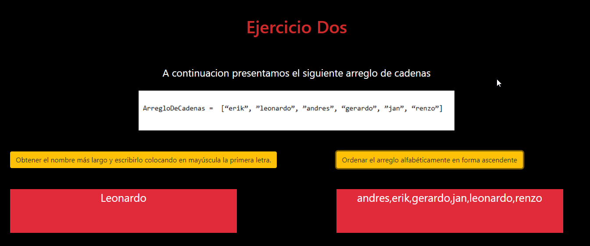

# RETO DOS

Dado el siguiente arreglo :

```array = ['erik', 'leonardo', 'andres', 'gerardo', 'jan', 'renzo']```

Desarrollar el código para cada uno de los siguientes casos:

1. Obtener el nombre más largo y escribirlo colocando en mayúscula la primera letra.
Ordenar el arreglo alfabéticamente en forma ascendente(a-z), SIN USAR los métodos nativos (sort, map, filter, each) y mostrar el resultado en un listado.
Obtener el número mayor del arreglo.

2. Obtener el nombre más largo y escribirlo colocando en mayúscula la primera letra.
Ordenar el arreglo alfabéticamente en forma ascendente(a-z), SIN USAR los métodos nativos (sort, map, filter, each) y mostrar el resultado en un listado.
.




##ORDENAMIENTO DE BURBUJA
 
 Para resolver el segundo enunciado Es necesario saber sobre el Algoritmo de ordenamiento de burbuja.

 Es un sencillo algoritmo de ordenamiento. Funciona revisando cada elemento de la lista que va a ser ordenada con el siguiente, intercambiándolos de posición si están en el orden equivocado. Es necesario revisar varias veces toda la lista hasta que no se necesiten más intercambios, lo cual significa que la lista está ordenada. 


 ##Podemos observar de manera dinamica como hace la comparacion este algoritmo

 

## Herramientas Tecnológicas

* HTML 5

* CSS 3

* Javascript

## Desarrollado por 

  Nefeli Joñoruco Morales 
  
## Desarrollado para

[El Comercio](https://elcomercio.pe/)


